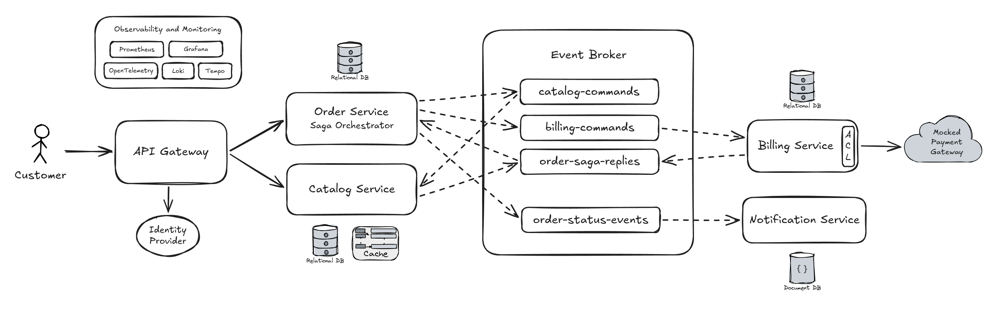
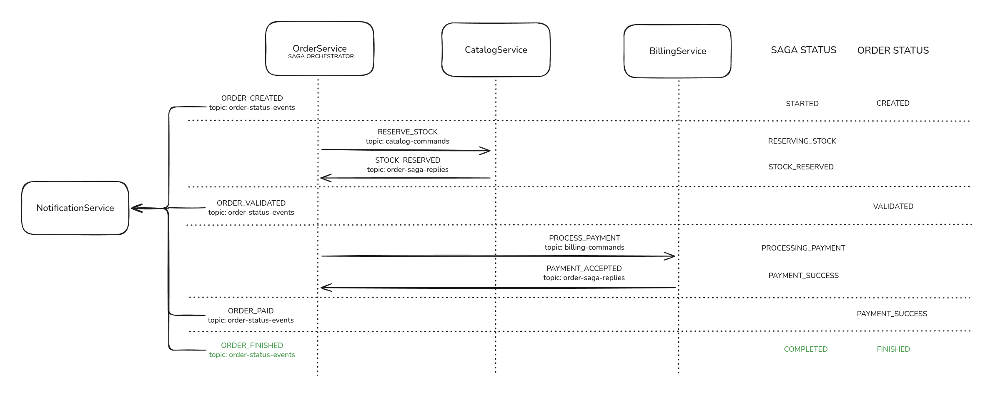
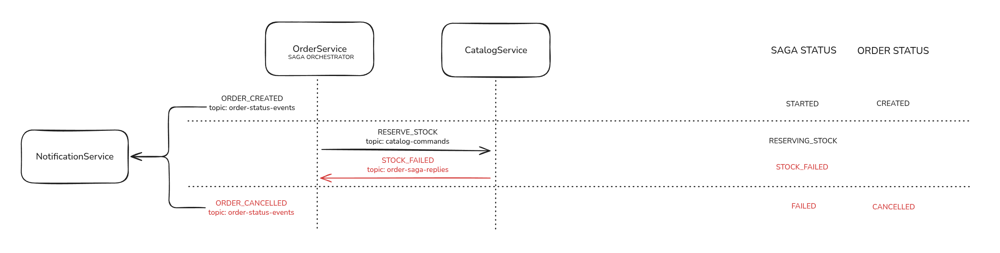
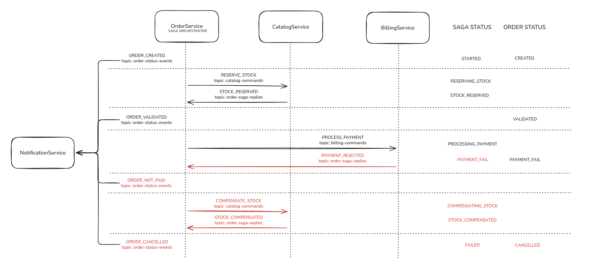

# [WIP] E-commerce Backend (tech lab)

This project serves as a technical laboratory to explore and implement industry-standard patterns for distributed systems, acting as a living documentation of my journey through advanced Java development and modern software architecture.

The ecosystem simulates a resilient e-commerce backend, orchestrating the checkout journey through multiple microservices. It is designed to handle order placement and execute an asynchronous flow, including:

- **Order orchestration:** managing the lifecycle of a customer purchase.
- **Catalog management:** handling stock reservation and price consistency.
- **Payment processing:** mocking integrations to simulate successful and failed transaction scenarios.
- **Notifications:** dispatching e-mail updates to customers.

## Table of Contents
- [1. Tech stack](#1-tech-stack)
- [2. How to run](#2-how-to-run)
- [3. Architecture](#3-architecture)
- [4. Desicions](#4-decisions)
- [5. Roadmap](#5-roadmap)

## 1. Tech stack

### Backend, Messaging & Database
- **Java 21**
- **Spring Boot 3.5**
- **Apache Kafka**
- **PostgreSQL**
- **MongoDB**
- **Redis**
- **Docker**
- **Docker Compose**

### Observability & Monitoring
- **OpenTelemetry:** zero-code instrumentation via Java Agent
- **Prometheus:** metrics collection and storage
- **Loki:** log aggregation with trace correlation
- **Tempo:** distributed tracing
- **Grafana:** centralized visualization dashboard

## 2. How to run

### Start the infrastructure and services

```bash
docker compose --profile services up -d --build
```

### Stop the infrastructure and services

```bash
docker compose --profile services down
```

## 3. Architecture

### System architecture overview


### Event flow - Scenario 1: The happy path


### Event flow - Scenario 2: Out-of-stock exception


### Event flow - Scenario 3: Payment failure & inventory compensation


## 4. Decisions

### Observability & Monitoring
I adopted an observability-first (day zero) approach, configuring the full monitoring stack from the very beginning. This ensures maximum visibility into the system's behavior, which is crucial given the inherent complexity of tracing asynchronous flows in event-driven architectures.

### Event-Driven Architecture (EDA)
The system leverages an Event-Driven Architecture to achieve high decoupling and horizontal scalability. By communicating asynchronously, services remain autonomous, significantly increasing resilience by eliminating Single Points of Failure (SPOF). I acknowledge the increased complexity in debugging and traceability, the mandatory requirement for idempotent consumers, and the shift toward eventual consistency.

### Apache Kafka
Apache Kafka was selected as the primary event broker due to its distributed log nature, high durability, and robust data retention. This choice allows for event replayability, enabling the system to reprocess flows for auditing or disaster recovery purposes.

### Distributed Transactions: Orchestrated Saga Pattern
Implementation of the Orchestrated Saga Pattern, with the Order Service acting as the central "conductor". This design manages distributed transactions and handles failures through compensating actions, centralizing the state machine logic. Through this approach, I gained improved transaction traceability, eemasier maintenance of core business logic, and reduced cyclic dependencies compared to a choreographed design. The primary trade-off is the increased internal complexity concentrated within the orchestrating service.

### Decoupled Notification Service
Given its nature as a background "worker", the notification service operates independently from the main saga flow. It purely consumes domain events, allowing notifications to be sent without adding latency or overhead to the core transaction orchestration.

### Transactional Inbox/Outbox Patterns
- **Inbox**: Implementation of the Transactional Inbox Pattern (Idempotent Consumer) to handle technical idempotency. In this scenario, ensuring idempotency is not optional; it is a requirement for data consistency. Since Kafka guarantees at-least-once delivery, the same message can be delivered multiple times due to network retries, consumer rebalancing, or transient failures. Without a mechanism to handle these duplicates, the system would suffer from undesirable critical side effects.

- **Outbox**: Implementation of the Transactional Outbox Pattern in all services participating in the Saga orchestration. This pattern solves the "dual-write" problem by ensuring that database updates and message publishing happen atomically. By persisting events in the same local transaction as the business data, I guarantee at-least-once delivery, preventing the system from entering an inconsistent state if the broker is temporarily unavailable. The primary trade-off is increased internal complexity, it requires managing an additional table and a dedicated publishing process.

### Database
I adopted a polyglot persistence approach to ensure each microservice uses the storage engine best suited for its specific consistency and data modeling requirements:

- **PostgreSQL (relational)** was chosen for services where ACID compliance and relational integrity are non-negotiable, such as order, catalog and billing. Its robust transaction management is critical for ensuring that the steps of the saga orchestration are persisted reliably.

- **MongoDB (document-oriented)** was chosen for the Notification service to handle polymorphic data structures. Given that notification metadata varies significantly between channels (E-mails, SMS, WhatsApp or Push), a document-oriented approach provides the necessary schema flexibility.

- **Redis (key-value)** was adopted for the catalog service to serve as a high-performance caching layer. By storing frequently accessed product data in memory, it significantly reduces the number of direct database lookups. This decision ensures low latency for the client and offloads read pressure from the primary data store, which is crucial for maintaining system responsiveness during high-traffic scenarios.

### Testing
Implementation of unit and integration tests, primarily focused on the integration layer, utilizing Testcontainers with the actual infrastructure stack (PostgreSQL, MongoDB, Kafka, etc.) to ensure high quality and reliability during feature development.

## 5. Roadmap
- [X] Observability and monitoring.
- [ ] Database and messaging system setup.
- [ ] Microservices implementation.
- [ ] Authentication and authorization.
- [ ] API gateway integration.
